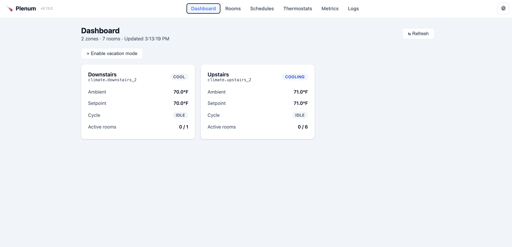
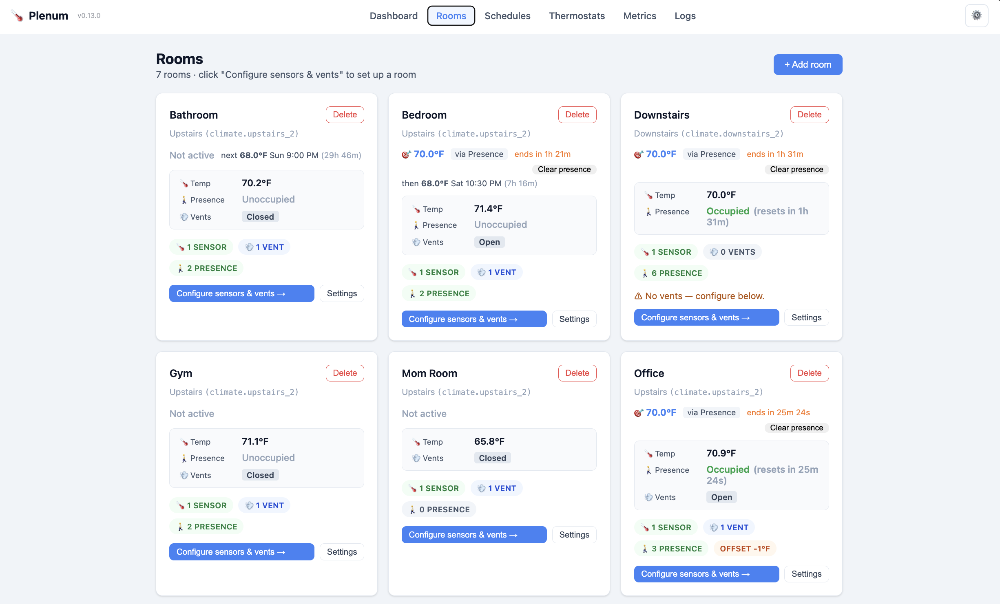
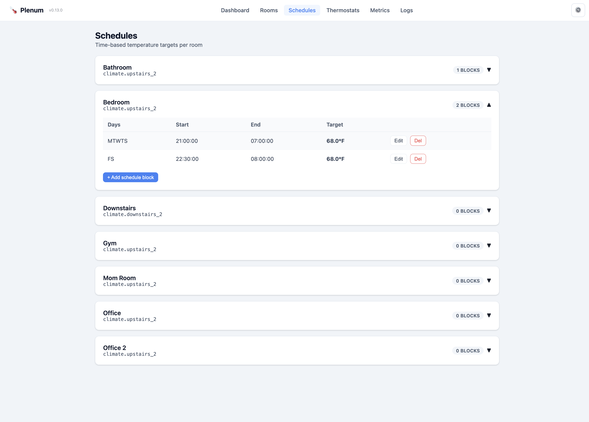
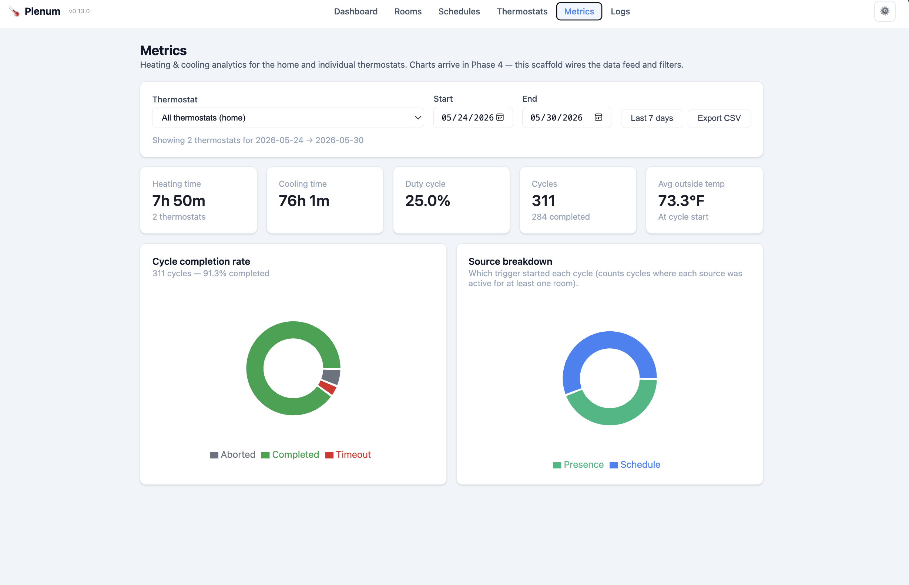
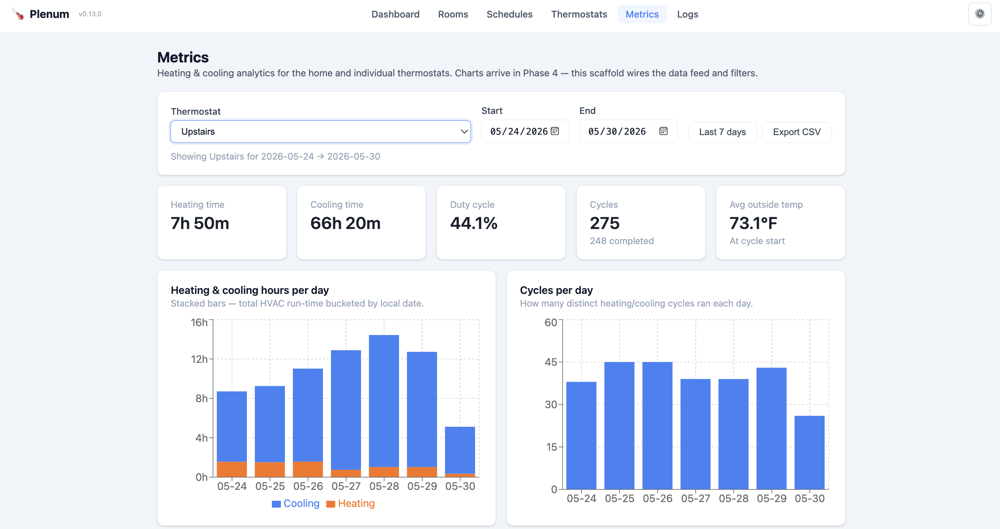
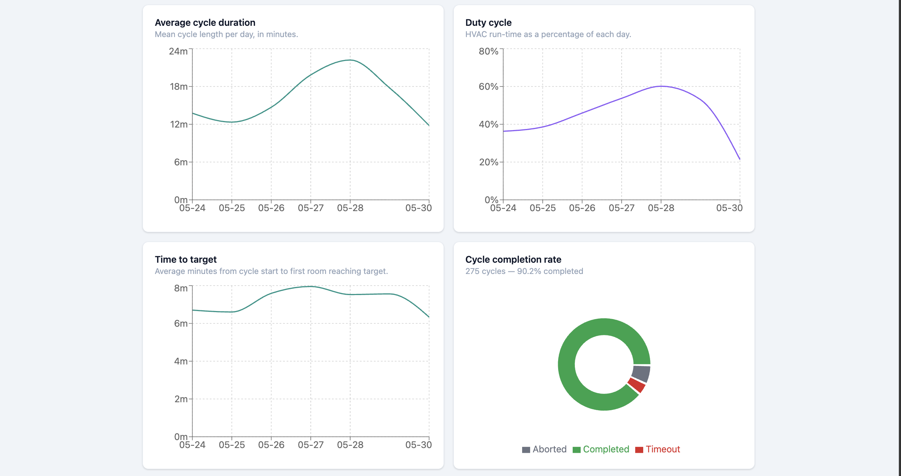
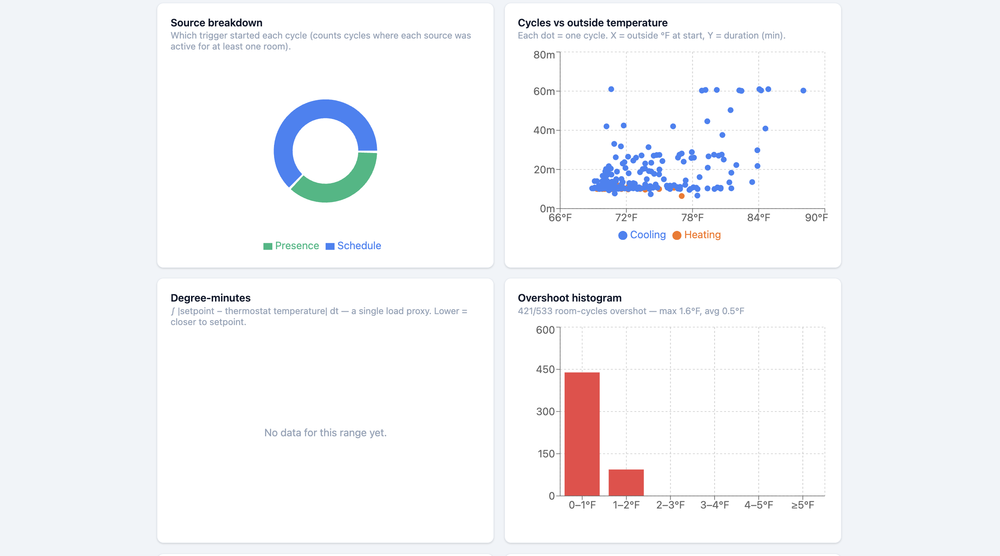
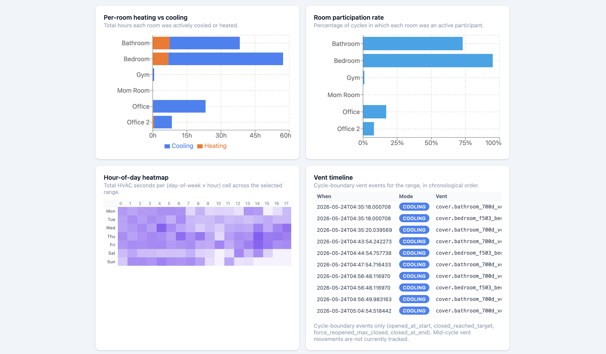
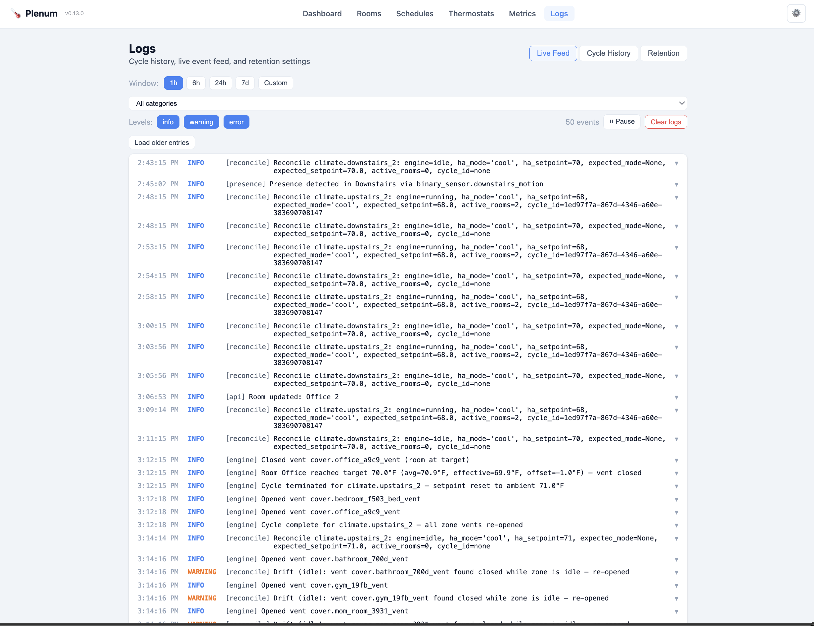
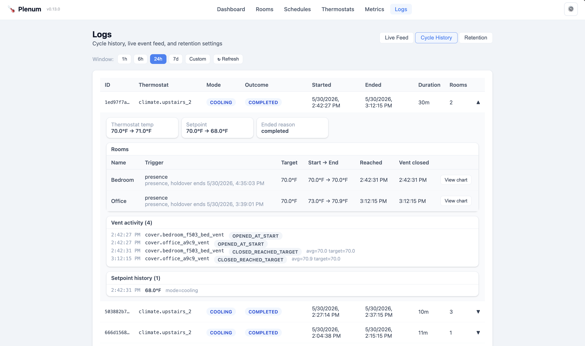

# Plenum

> **AI-generated disclaimer:** this project — code, tests, and documentation — was developed with substantial help from AI coding assistants. Review the diffs, run the tests, and exercise normal judgement before trusting it to run your HVAC.

## About this project

Plenum began as a replacement for [Flair.co](https://flair.co)'s scheduler. I wanted to pull in additional sensors — extra room temp sensors, motion sensors, outdoor conditions — and drive my HVAC off a richer picture than what the Flair app supports. Flair's hardware is great; their scheduler just didn't have the hooks I wanted.

So Plenum **schedules and decides**, and then hands the actual vent control back to the excellent [RobertD502/home-assistant-flair](https://github.com/RobertD502/home-assistant-flair) HACS integration, which exposes each Flair vent as a Home Assistant `cover.*` entity. Plenum talks to HA, never to Flair's cloud directly.

Because Plenum only speaks to `cover.*` and `climate.*` entities, **it's not Flair-specific**. Any cover integration works — Flair via HACS, SmartThings vents, Keen Home, Zigbee/Z-Wave roller shutters, anything you can drive as a cover — and any HA `climate.*` thermostat can host a zone. Any `sensor.*` can feed into a room's average temperature, and any `binary_sensor.*` can trigger presence activation.

### Tested

> Stats last updated: September 2026 — coverage thresholds are enforced by CI and only ever increase.

- **Backend:** **1900+ unit + integration tests** across **96 test modules** (41 unit + 55 integration) covering the cycle engine state machine, scheduler, room manager, vent controller, presence/holdover logic, setpoint bounds, cycle restore after reboot, idle-vent close dispatch, the authentication trust boundary (ingress spoof-rejection, session cookies, MCP token scopes), the MQTT bridge and discovery registry, and end-to-end cycle flow through the aiohttp API. Coverage gate: **96.7%** enforced by CI.
  - `pytest backend/tests` from `smart_vent/` runs the full suite.
- **Frontend:** **550+ tests** across **33 test files** with **Vitest + React Testing Library**, covering all major pages and components, form validations, tab navigation, unit-conversion correctness, the login/auth gate, and WebSocket integration. Coverage gates enforced by CI: **94.2% lines · 91.3% functions · 79.9% branches · 92.0% statements**.
  - `npm test` from `smart_vent/frontend` runs the frontend suite.
- **E2E (Playwright):** **42 end-to-end tests** across **18 spec files** covering every major page (Dashboard, Rooms, Schedules, Thermostats, Metrics, Logs, Settings, Dev Mode, Vacation Mode, Eco Suspend) plus the login/auth gate and a full temperature round-trip suite that matrix-runs against both a °F stack and a °C stack — the only layer that exercises the full frontend → API → DB → UI conversion contract end-to-end.
  - Specs live in `e2e/tests/`; CI runs them via the `conversion` job in `.github/workflows/container-ci.yml`.

---

## What it does

A Home Assistant add-on that provides HVAC zoning control for your home. Plenum drives HA cover entities (smart vents like Flair, or any other `cover.*` integration) and climate thermostats using temperature data from your native HA sensors, with per-room scheduling, presence-based activation, and a full web UI accessible via HA Ingress. Access through the Home Assistant sidebar is always trusted; if you publish the raw web-UI or MCP ports, they can require authentication (Home Assistant login for the UI, scoped bearer tokens for MCP) — see [`docs/auth.md`](docs/auth.md).

## Screenshots

The Dashboard shows each thermostat zone at a glance: ambient temperature, setpoint, HVAC mode, cycle state, and active room count.



The Rooms page lists every room with its current temperature, presence state, and vent status. Click **Configure sensors & vents** to attach HA entities to each room.



The Schedules page defines per-room time blocks (days, start/end time, target temperature). Rooms activate automatically when the current time falls inside a matching block.



The Metrics page shows aggregate stats across all thermostats — total heating/cooling time, duty cycle, cycle count, and completion rate broken down by trigger source.



Drilling into a single thermostat reveals time-series charts (heating hours per day, duty cycle, average cycle duration, time to target), a scatter plot of cycle duration vs. outside temperature, an overshoot histogram, per-room participation rates, an hour-of-day heatmap, and a chronological vent event timeline.






The Live Feed streams every significant event in real time — vent opens/closes, cycle transitions, setpoint changes, presence detections — with filterable severity levels and expandable JSON detail.



Cycle History shows each completed HVAC cycle with its full room breakdown, vent activity log, and setpoint history.



## Documentation

Feature-by-feature guides live in [`docs/`](./docs/README.md):

- [Rooms & zones](./docs/rooms-and-zones.md)
- [Cycle engine](./docs/cycle-engine.md) — how a cycle runs, tick by tick
- [Vent control methods](./docs/vent-control.md) — open/close, set_position, set_tilt_position, toggle
- [Thermostat settings](./docs/thermostat-settings.md) — overshoot, deadband, safety limits
- [Safety features](./docs/safety.md) — short-cycle protection, outdoor-temperature cooling lockout
- [Schedules](./docs/schedules.md) — time blocks and overnight ranges
- [Presence & motion](./docs/presence.md) — motion activation and holdover
- [Pre-cool / pre-heat](./docs/precool-presence.md) — skip presence HVAC when the outside air will reach the target on its own
- [Eco Mode](./docs/eco-mode.md) — relax targets when it's extreme outside (outdoor-compensated setpoint drift)
- [Overflow conditioning](./docs/overflow-conditioning.md) — the min-runtime-hold surplus-air tiering
- [System modes](./docs/system-modes.md) — System On/Off and Dev Mode
- [Observability](./docs/observability.md) — dashboard, logs, WebSocket
- [Metrics & analytics](./docs/metrics.md) — heating/cooling charts, outside-temp correlation, CSV export
- [Backup & restore](./docs/backup-restore.md)
- [Authentication & trust model](./docs/auth.md) — ingress vs. direct-port trust, HA login, OIDC single sign-on, MCP token scopes
- [MCP server](./docs/mcp.md) — Claude-callable tools
- [MQTT interface](./docs/mqtt.md) — control Plenum from Home Assistant automations
- **API Documentation** — Interactive Swagger UI available at `/api/docs`

---

## How it works

Each thermostat zone gets one HVAC cycle engine. When rooms in a zone become active (via schedule or motion), the engine:

1. Opens all active room vents
2. Sets the thermostat setpoint past the target by an overshoot delta (e.g. +2°F for heating) to keep the HVAC running
3. Monitors each room's average temperature from its sensors
4. Closes a room's vents when it hits its target temperature
5. Once all rooms are at target, resets the thermostat setpoint to its own ambient reading — the HVAC shuts off naturally

Multiple rooms sharing one thermostat are fully supported and are the primary use case.

---

## Safety

Plenum drives real HVAC equipment, so it includes protections that exist purely to keep that equipment safe from software decisions:

- **Short-cycle protection** — a minimum compressor run time and a minimum off-time between cycles, so the equipment is never rapidly stopped and restarted.
- **In-place cycle updates** — a mid-cycle change to a room's target or source (a schedule edit, a presence-to-schedule handoff) is applied to the running cycle instead of stopping and restarting the HVAC, avoiding an unnecessary compressor stop/start.
- **Outdoor-temperature cooling lockout** — refuses to start a cooling cycle when it is too cold outside, where running an AC compressor risks liquid slugging and coil icing.
- **Airflow floor / dead-head protection** — keeps a configurable fraction (default one third) of the thermostat's total registers open at all times, accounting for passive (non-smart) vents that are always open. Tickable opt-out for systems with a bypass damper.
- **Equipment-protection limits** — setpoint clamps, a force-reopen valve for closed vents, and a cycle timeout for stuck equipment.

> Plenum assumes a conventional HVAC system (furnace/air handler + AC compressor). **Heat pumps are not supported.**

See [`docs/safety.md`](./docs/safety.md) for how each protection works and how to configure it.

---

## Installation

### Option A — Home Assistant Add-on (recommended)

1. In HA, go to **Settings → Add-ons → Add-on Store → ⋮ → Repositories**
2. Add this repository URL
3. Find **Plenum** and click **Install**
4. Go to the add-on **Configuration** tab and set your **`timezone`** (e.g. `America/New_York`) — no token or URL is needed when running as an HA add-on
5. Click **Start** — the UI is available via the **Open Web UI** button (HA Ingress)

### Option B — Docker (standalone / testing)

Pull the image built by GitHub Actions:

```bash
docker pull ghcr.io/dhruvb14/smart-thermostat-with-vents:latest
```

Run it:

```bash
docker run -d \
  --name smart-vent \
  -p 8099:8099 \
  -v /path/to/data:/data \
  -e DATA_DIR=/data \
  -e HA_URL=https://your-ha-instance.com \
  -e HA_TOKEN=your_long_lived_token \
  -e TIMEZONE=America/New_York \
  -e REQUIRE_AUTH=false \
  ghcr.io/dhruvb14/smart-thermostat-with-vents:latest
```

> **Important:** `run.sh` defaults `DATA_DIR` to `/config`, not `/data` — without `-e DATA_DIR=/data` above, the app writes `app.db` inside the container instead of your mounted volume, and every restart wipes your configuration. Likewise, the timezone variable is `TIMEZONE`, not `TZ` — `run.sh` overwrites `TZ` from `TIMEZONE` unconditionally, so setting `-e TZ=...` alone has no effect and schedules will evaluate in UTC.

> **Important:** the `-v /path/to/data:/data` volume mount is required. Without it, `app.db` is written inside the ephemeral container layer and **all configuration is lost when the container restarts**.

> **You are running Plenum without authentication.** `REQUIRE_AUTH=false` is set above because Plenum's default login (`require_auth`, on by default) authenticates against the Home Assistant Supervisor's `/auth` backend — which doesn't exist in a standalone container, so without this flag the UI would be unreachable off HAOS. With it set, **anyone who can reach `8099`/`9099` on your network has full read/write control of your HVAC, no credentials required.** This is the pre-#373 legacy behavior, intended for local/trusted-network testing only.
>
> - **Never** publish `8099`/`9099` to the public internet while `REQUIRE_AUTH=false` is set.
> - To keep authentication enabled instead, drop the `REQUIRE_AUTH` line and configure **OIDC single sign-on** — it works without a Supervisor and supports MFA. See [`docs/auth.md`](docs/auth.md#oidc-single-sign-on-optional-closes-the-two-direct-port-gaps) for the required `OIDC_*` environment variables.
> - This flag has no effect on Home Assistant ingress access, which is always separately trusted regardless of `REQUIRE_AUTH`.
> - A malformed value (anything other than `true`/`false`, `1`/`0`, `yes`/`no`, `on`/`off`, or unset) makes the container **refuse to start** — a typo in an authentication toggle fails loudly instead of silently leaving the ports open.

Open `http://localhost:8099` in your browser. See [`docs/auth.md`](docs/auth.md) for the full trust model, including how ingress requests are told apart from direct-port ones.

### Option C — Local development

1. **Clone the repository**
```bash
git clone https://github.com/dhruvb14/smart-thermostat-with-vents.git
cd smart-thermostat-with-vents
```

2. **Configure environment**
```bash
cp .env.sample .env
# Edit .env with your Home Assistant URL and Long-Lived Token
```

3. **Install Python backend**
```bash
# Requires Python >= 3.12
python3 -m venv .venv
source .venv/bin/activate
pip install -e ./smart_vent
```

4. **Build the frontend**
```bash
cd smart_vent/frontend
npm install
npm run build
cd ../..
```

5. **Run the server**
```bash
source .venv/bin/activate
cd smart_vent
python -m backend.main
```
Then open `http://localhost:8099` (or the port defined in your `.env`) in your browser to view the UI.

#### Running from VS Code

Open the repo in VS Code and hit **F5** — the workspace ships with `.vscode/launch.json` configurations for:

- **Backend (Python)** — runs `python -m backend.main` under the debugger.
- **Frontend (Chrome / Edge)** — auto-starts the Vite dev server on port 5173 (proxies `/api` and `/ws` to the backend on 8099) and launches a debug-attached browser.
- **Full stack (Backend + Frontend)** — compound launch that starts both at once.
- **Backend tests (pytest)** — runs the backend test suite with breakpoints.

Recommended extensions are listed in `.vscode/extensions.json` (Python, Ruff, ESLint, Prettier).

---

## Getting a Long-Lived Access Token

1. In HA, click your profile picture (bottom-left)
2. Scroll to **Long-Lived Access Tokens**
3. Click **Create Token**, give it a name (e.g. `smart-vent`)
4. Copy the token — you won't see it again

---

## Timezone configuration

Plenum evaluates all schedule times in the timezone configured on the add-on. **You must set this** — the default is `UTC`, which will misfire schedules unless your local time happens to be UTC.

1. In Home Assistant, go to **Settings → Add-ons → Plenum → Configuration**.
2. Set the **`timezone`** field to your IANA zone (e.g. `America/New_York`, `America/Chicago`, `America/Denver`, `America/Los_Angeles`, `Europe/London`, `Europe/Paris`, `Asia/Tokyo`).
3. Click **Save** — the add-on will restart and pick up the new timezone.

This also handles DST transitions automatically. The value is exported as the `TZ` environment variable to the Python process, so all `astimezone()` / local-time conversions (used by schedules and presence holdover) resolve in the right zone.

---

## First-time setup

Once the UI is open, follow these steps in order:

### 1. Register your thermostats

Go to **Thermostats → + Register thermostat**

- Pick the HA climate entity for each of your HVAC systems
- Give it a friendly name (e.g. "Upstairs HVAC", "Downstairs HVAC")
- Set a **Default presence temp** — this is the fallback temperature used when a room is activated by motion and has no room-level presence temp configured
- Adjust safety limits if needed (min/max setpoint, deadband, overshoot delta)

### 2. Create rooms

Go to **Rooms → + Add room**

- Give the room a name
- Select which registered thermostat controls this zone
- Optionally set a room-level presence temperature (overrides the thermostat default)

### 3. Configure sensors and vents

Click **Configure sensors & vents →** on any room card.

**Temperature Sensors** — add all `sensor.*` entities in the room. The engine averages them. Add as many as you want.

**Vents** — add the `cover.*` entities for each vent in the room. These are what gets opened and closed during cycles.

**Presence / Motion Sensors** — add `binary_sensor.*` entities. When any fires, the room activates at the presence temperature and stays active for the holdover period (default 2 hours, reset on each detection).

### 4. Add schedules

Go to **Schedules**, select a room, and add time blocks. Each block has:
- Days of week
- Start and end time
- Target temperature (°F)

Rooms activate when the current time falls inside a matching block.

### 5. Enable the system

The **System On/Off** toggle in the top-right of every page controls whether the engine makes any changes to HA. While **System Off**, the engine monitors state but makes zero calls to HA — no vent moves, no setpoint changes. Use this while transitioning from another HVAC control system.

---

## Room settings reference

| Setting | Description |
|---|---|
| **Thermostat** | Which registered thermostat (zone) this room belongs to |
| **Presence temp** | Target °F when activated by motion, no schedule active. Falls back to thermostat default if blank. |
| **Presence holdover** | How long (hours) to keep the room active after last motion. 0 = disabled. |
| **Include thermostat sensor** | Average the thermostat's own built-in sensor along with the room sensors |
| **Temperature offset** | Added to the room's measured avg before comparing to target. Use to compensate for post-closure drift — e.g. if your room targets 70°F but always ends up at 67°F after the vent closes, set +3 so the vent closes at 67°F actual (67+3=70 "at target") and the room drifts to ~70°F |

---

## Thermostat settings reference

| Setting | Description |
|---|---|
| **Default presence temp** | Fallback target °F for presence-activated rooms that have no room-level presence temp |
| **Min / Max setpoint** | Hard clamps — the engine will never set the thermostat outside this range |
| **Deadband** | ±°F tolerance for "at target". 0 = exact match. 0.5 means a 70°F target is satisfied at 69.5–70.5°F |
| **Overshoot delta** | How far past the most demanding room's target to set the thermostat to keep the HVAC running (default 2°F) |
| **Max vent closed** | Reopen a vent after this many minutes even if the room is still at target (safety valve for systems that need airflow). 0 = disabled |
| **Min open vents** | Always keep at least this many vents open across the zone. 0 = allow all closed |
| **Cycle timeout** | Abort a cycle that has been running longer than this many hours |

---

## Migrating from a dev/local instance

All configuration lives in a single SQLite file (`app.db` in the `DATA_DIR`). To carry your setup over:

1. Stop the add-on
2. Copy your local `app.db` (default: `./data/app.db`, per `DATA_DIR` in `.env.sample`) to the add-on data directory:
   - **HA OS / Supervised**: the real host path is `/mnt/data/supervisor/addons/data/<repo_id>_plenum/app.db`. Find your exact path via SSH with `docker inspect $(docker ps -q --filter name=plenum) --format '{{ json .Mounts }}'` and look for the mount whose `Destination` is `/data`. Note: `/root/addon_configs` (the Samba share) is for add-on *configuration* files, not this data directory.
   - **Docker**: wherever you mounted `/data` with `-v`
3. Start the add-on — it will apply any pending migrations automatically

**Upgrading from ≤0.6.x:** the on-disk database was previously named `flair.db`. The add-on renames it to `app.db` automatically on first boot after upgrade — no manual steps required.

---

## Dashboard

The Dashboard shows one card per thermostat zone with:
- Friendly thermostat name and HA entity ID
- Current HVAC action (heating / cooling / idle / off)
- Ambient temperature and active setpoint
- Cycle state and per-room progress bar
- Live vent states (open/closed) for all active rooms

It updates in real time via WebSocket.

---

## Logs

The **Logs** page has two tabs:

**Live Feed** — every significant event in real time: vent opens/closes, cycle starts/ends, setpoint changes, presence detections, API mutations, system enable/disable. Filter by category (engine, api, presence, ha, system). Click any entry to expand JSON details. Pause button stops auto-scroll.

**Cycle History** — a table of completed and active HVAC cycles with duration, mode, and per-room breakdown.

---

## API Documentation

Plenum ships with built-in **OpenAPI (Swagger)** documentation. This provides an interactive playground to explore the REST API, view schema definitions, and test endpoints directly from your browser.

- **Access:** Click the **📖 API Docs** button in the top banner of the web UI.
- **Direct URL:** Available at `/api/docs` (or `/api/docs/` behind Home Assistant Ingress).
- **Format:** The raw OpenAPI specification is available at `/api/docs/openapi.json`.

---

## Architecture

```
HA WebSocket API
      │
      ▼
 ha_client.py        ← state cache + service calls (cover, climate)
      │
      ▼
 scheduler.py        ← one CycleEngine per thermostat, 60s tick
      │
      ├── cycle_engine.py   ← HVAC cycle state machine
      ├── vent_controller.py ← open/close with safety guards
      └── room_manager.py   ← schedule / presence / override resolution
      │
      ▼
 aiohttp server
      ├── REST API  (/api/*)
      ├── WebSocket (/ws)
      ├── OpenAPI Docs (/api/docs)
      └── Static frontend (React + Vite)
```

Data is persisted in SQLite via `aiosqlite`. No external services or cloud dependencies.

---

## Docker image

Built automatically by GitHub Actions on every push to `main` and on `v*.*.*` tags.

```
ghcr.io/dhruvb14/smart-thermostat-with-vents:latest
ghcr.io/dhruvb14/smart-thermostat-with-vents:sha-<commit>
ghcr.io/dhruvb14/smart-thermostat-with-vents:1.2.3   # on version tags
```
